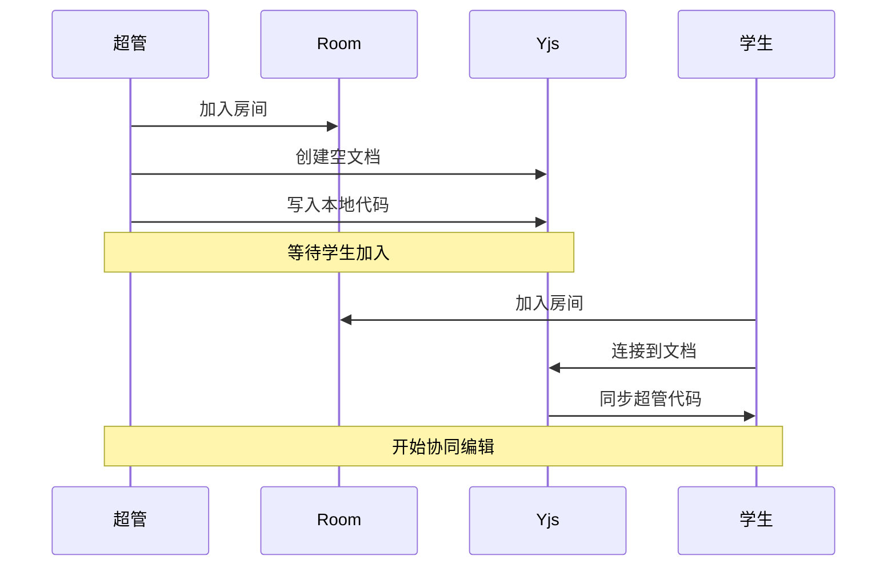
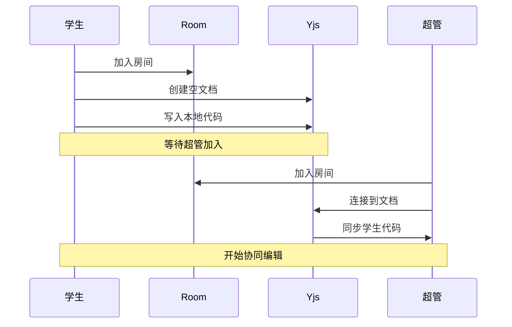
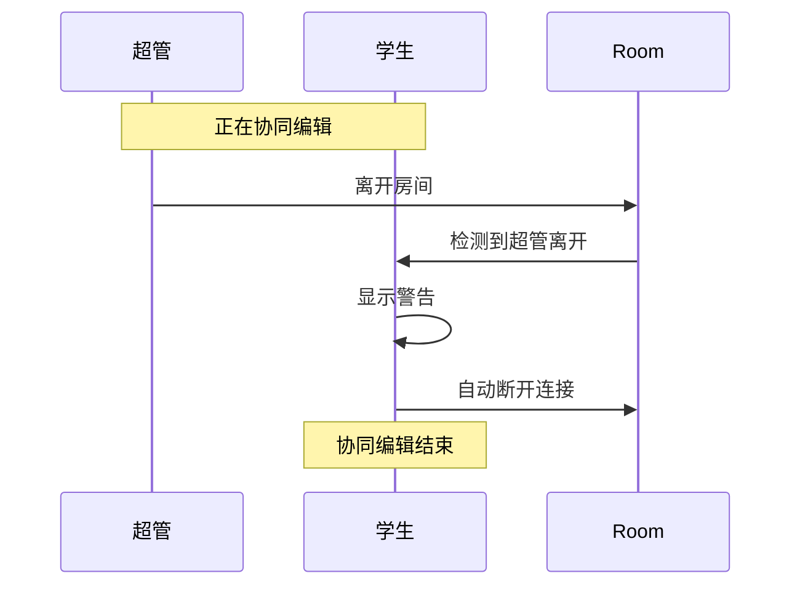

# 协同编辑功能文档

## 📚 目录

- [概述](#概述)
- [技术栈](#技术栈)
- [核心概念](#核心概念)
- [架构设计](#架构设计)
- [详细实现](#详细实现)
- [工作流程](#工作流程)
- [API 文档](#api-文档)
- [使用示例](#使用示例)
- [故障排查](#故障排查)
- [使用限制](#使用限制)
- [安全考虑](#安全考虑)
- [配置](#配置)

## 概述

协同编辑功能允许超级管理员和学生在同一个代码编辑器中实时协作，查看彼此的代码修改和光标位置。该功能基于 Yjs 和 WebRTC 实现，支持点对点连接。

### 核心特性

- ✅ 实时代码同步
- ✅ 光标位置共享
- ✅ 用户颜色标识（超管红色，学生蓝色）
- ✅ 动态扩展加载（按需加载 yjs 依赖）
- ✅ 权限控制（必须有一个超管）
- ✅ 房间人数限制（最多 2 人）
- ✅ 离线检测和自动清理
- 🖥️ 仅支持桌面端（移动端不可用）

## 技术栈

| 技术 | 版本 | 用途 |
|------|------|------|
| Yjs | Latest | CRDT 文档同步 |
| y-webrtc | Latest | WebRTC 传输层 |
| y-codemirror.next | Latest | CodeMirror 6 集成 |
| CodeMirror 6 | Latest | 代码编辑器 |
| Vue 3 | Latest | 前端框架 |

## 核心概念

### 1. Yjs (Y.js)

Yjs 是一个 CRDT（Conflict-free Replicated Data Type）实现，提供：
- 无冲突的并发编辑
- 操作的自动合并
- 离线支持

### 2. WebRTC Provider

通过 WebRTC 建立点对点连接：
- 信令服务器协调连接
- P2P 数据传输
- 自动重连机制

### 3. Awareness

Awareness 协议用于共享用户状态：
- 用户信息（名称、角色）
- 光标位置
- 选择范围
- 用户颜色

### 4. Compartment

CodeMirror 的扩展管理机制：
- 动态添加/移除扩展
- 无需重新创建编辑器
- 保持编辑器状态

## 架构设计

```
┌─────────────────────────────────────────────────────────────┐
│                        用户界面层                             │
│  ┌──────────────┐  ┌──────────────┐  ┌──────────────┐      │
│  │   Form.vue   │  │  Editor.vue  │  │CodeEditor.vue│      │
│  └──────┬───────┘  └──────┬───────┘  └──────┬───────┘      │
│         │                  │                  │              │
└─────────┼──────────────────┼──────────────────┼──────────────┘
          │                  │                  │
          │      Props/Events│                  │
          │                  ▼                  │
          │         ┌─────────────────┐        │
          │         │  Sync Control   │        │
          │         │   (Editor.vue)  │        │
          │         └────────┬────────┘        │
          │                  │                  │
          └──────────────────┼──────────────────┘
                             │
                             ▼
          ┌──────────────────────────────────────┐
          │         sync.ts (useCodeSync)        │
          │  ┌────────────────────────────────┐  │
          │  │      状态管理                   │  │
          │  │  - ydoc, provider, ytext       │  │
          │  │  - collabCompartment           │  │
          │  │  - roomUserInfo                │  │
          │  └────────────────────────────────┘  │
          │  ┌────────────────────────────────┐  │
          │  │      核心功能                   │  │
          │  │  - startSync()                 │  │
          │  │  - stopSync()                  │  │
          │  │  - 权限检查                     │  │
          │  │  - 内容同步                     │  │
          │  └────────────────────────────────┘  │
          └──────────────┬───────────────────────┘
                         │
          ┌──────────────┴───────────────┐
          │                              │
          ▼                              ▼
  ┌───────────────┐            ┌─────────────────┐
  │   Yjs CRDT    │◄──────────►│  WebRTC P2P     │
  │   Document    │            │   Connection    │
  └───────────────┘            └─────────────────┘
          │                              │
          │                              │
          ▼                              ▼
  ┌───────────────┐            ┌─────────────────┐
  │  CodeMirror   │            │  Signaling      │
  │  Extension    │            │  Server         │
  └───────────────┘            └─────────────────┘
```

## 详细实现

### 1. 初始化流程

```typescript
// 1. 检查用户登录状态
if (!userStore.isAuthed) {
  return error
}

// 2. 动态导入依赖（按需加载）
const [Y, { WebrtcProvider }, { yCollab }] = await Promise.all([
  import("yjs"),
  import("y-webrtc"),
  import("y-codemirror.next"),
])

// 3. 创建 Yjs 文档
ydoc = new Y.Doc()
ytext = ydoc.getText("codemirror")

// 4. 创建 WebRTC Provider
provider = new WebrtcProvider(roomName, ydoc, {
  signaling: [SIGNALING_URL],
  maxConns: 1,
  filterBcConns: true,
})

// 5. 设置用户信息
provider.awareness.setLocalStateField("user", {
  name: userName,
  color: userColor,
  isSuperAdmin: isSuperAdmin,
})

// 6. 应用协同编辑扩展
const collabExt = yCollab(ytext, provider.awareness)
editorView.dispatch({
  effects: collabCompartment.reconfigure(collabExt),
})
```

### 2. 权限检查机制

#### 房间人数检查
```typescript
if (roomUsers > MAX_ROOM_USERS) {
  // 超过2人，断开连接
  stopSync()
  return
}
```

#### 超管检查
```typescript
const checkHasSuperAdmin = (awarenessStates) => {
  if (userStore.isSuperAdmin) return true
  return Array.from(awarenessStates.values()).some(
    (state) => state.user?.isSuperAdmin
  )
}
```

#### 状态判断逻辑
```typescript
if (roomUsers === 2 && !hasSuperAdmin) {
  // 房间满员但没有超管
  status = "error"
} else if (roomUsers === 2 && hasSuperAdmin) {
  // 房间满员且有超管，可以协作
  status = "active"
} else {
  // 等待其他用户加入
  status = "waiting"
}
```

### 3. 内容同步策略

#### 第一个进入房间的用户

```typescript
// 1. 保存当前编辑器内容
const savedContent = editorView.state.doc.toString()

// 2. 清空编辑器
editorView.dispatch({
  changes: { from: 0, to: doc.length, insert: "" }
})

// 3. 应用协同扩展

// 4. 等待同步完成或超时
setTimeout(() => {
  if (ytext.length === 0 && savedContent) {
    // 房间为空，写入本地内容
    ytext.insert(0, savedContent)
  }
}, INIT_SYNC_TIMEOUT)
```

#### 第二个进入房间的用户

```typescript
// 1. 保存当前编辑器内容（将被覆盖）
const savedContent = editorView.state.doc.toString()

// 2. 清空编辑器
editorView.dispatch({
  changes: { from: 0, to: doc.length, insert: "" }
})

// 3. 应用协同扩展

// 4. 监听首次同步完成
provider.on("synced", (event) => {
  if (ytext.length > 0) {
    // yCollab 自动将远程内容同步到编辑器
    // 无需手动操作
  }
})
```

### 4. 事件监听

#### 连接状态监听
```typescript
provider.on("status", (event) => {
  if (!event.connected) {
    // 连接断开，通知用户
    message.warning("协同编辑连接已断开")
  }
})
```

#### 用户加入/离开监听
```typescript
provider.on("peers", (event) => {
  const roomUsers = event.webrtcPeers.length + 1
  // 检查房间人数和权限
  checkRoomPermissions(roomUsers)
})
```

#### Awareness 变化监听
```typescript
provider.awareness.on("change", (changes) => {
  // 检查超管是否离开
  if (changes.removed?.length > 0) {
    checkIfSuperAdminLeft(changes.removed)
  }
  
  // 更新房间用户信息
  updateRoomUserInfo(awarenessStates)
  
  // 重新检查权限
  checkRoomPermissions(roomUsers)
})
```

### 5. 清理机制

```typescript
function stopSync() {
  // 1. 移除编辑器扩展
  currentEditorView?.dispatch({
    effects: collabCompartment.reconfigure([])
  })
  
  // 2. 断开并销毁 Provider
  provider?.disconnect()
  provider?.destroy()
  
  // 3. 销毁 Yjs 文档
  ydoc?.destroy()
  
  // 4. 清空状态
  provider = null
  ydoc = null
  ytext = null
  roomUserInfo.clear()
  hasShownSuperAdminLeftMessage = false
}
```

## 工作流程

### 场景 1：超管先进入房间



### 场景 2：学生先进入房间



### 场景 3：超管离开



## API 文档

### useCodeSync()

协同编辑核心 Composable

**返回值：**

```typescript
{
  startSync: (options: SyncOptions) => Promise<() => void>
  stopSync: () => void
  getInitialExtension: () => Extension
}
```

### startSync(options)

启动协同编辑

**参数：**

```typescript
interface SyncOptions {
  problemId: string              // 题目 ID（用于房间名）
  editorView: EditorView         // CodeMirror 编辑器实例
  onStatusChange?: (status: SyncStatus) => void  // 状态变化回调
}
```

**返回：**

```typescript
Promise<() => void>  // 返回清理函数
```

**状态回调：**

```typescript
interface SyncStatus {
  connected: boolean         // 是否已连接
  roomUsers: number         // 房间人数
  canSync: boolean          // 是否可以同步
  message: string           // 状态消息
  error?: string           // 错误信息
  otherUser?: {            // 其他用户信息
    name: string
    isSuperAdmin: boolean
  }
}
```

### stopSync()

停止协同编辑并清理资源

**用法：**

```typescript
stopSync()
```

### getInitialExtension()

获取初始的 Compartment 扩展（空扩展）

**返回：**

```typescript
Extension  // CodeMirror 扩展
```

## 使用示例

### 基础用法

```vue
<script setup>
import { useCodeSync } from '~/shared/composables/sync'

const { startSync, stopSync, getInitialExtension } = useCodeSync()
const editorView = ref(null)
let cleanup = null

// 启动同步
async function enableSync() {
  cleanup = await startSync({
    problemId: 'problem-123',
    editorView: editorView.value,
    onStatusChange: (status) => {
      console.log('同步状态:', status)
      
      if (status.canSync) {
        console.log('可以开始协作了！')
      }
      
      if (status.otherUser) {
        console.log('正在与', status.otherUser.name, '同步')
      }
    },
  })
}

// 停止同步
function disableSync() {
  cleanup?.()
  stopSync()
}

// 编辑器扩展
const extensions = computed(() => [
  // ... 其他扩展
  getInitialExtension(),  // 协同编辑扩展
])
</script>
```

### 完整示例

参考项目中的文件：
- `src/shared/composables/sync.ts` - 核心实现
- `src/shared/components/CodeEditor.vue` - 编辑器组件
- `src/oj/problem/components/Editor.vue` - 容器组件
- `src/oj/problem/components/Form.vue` - UI 控制

## 故障排查

### 问题 1：无法连接

**症状：** 显示"正在等待加入"但始终无法连接

**可能原因：**
1. 信令服务器不可用
2. WebRTC 被防火墙阻止
3. 网络问题

**解决方案：**
```typescript
// 检查信令服务器配置
console.log(import.meta.env.PUBLIC_SIGNALING_URL)

// 检查浏览器控制台的 WebRTC 错误
```

### 问题 2：内容重复

**症状：** 第一个用户的代码被复制了两次

**原因：** yCollab 自动同步 + 手动插入

**解决方案：**
- 确保在应用 yCollab 扩展前清空编辑器
- 只在 ytext 为空时写入内容

### 问题 3：超管离开但学生未断开

**症状：** 超管离开后学生仍显示连接中

**原因：** Awareness 变化事件未触发或未处理

**解决方案：**
```typescript
// 确保监听 awareness change 事件
provider.awareness.on("change", (changes) => {
  if (changes.removed?.length > 0) {
    checkIfSuperAdminLeft(changes.removed)
  }
})
```

### 问题 4：光标不显示

**症状：** 开启同步后光标消失

**原因：** 
1. 编辑器失去焦点
2. 清空编辑器时未保持选区
3. 扩展未正确应用

**解决方案：**
- 使用 Compartment 动态管理扩展
- 避免手动操作编辑器 DOM
- 让 yCollab 自动处理内容同步

### 问题 5：第二个用户看不到第一个用户的代码

**症状：** 第二个进入的用户看到的是空白或自己的代码

**原因：** 内容同步逻辑错误

**解决方案：**
```typescript
// 第一个用户
provider.on("synced", () => {
  if (ytext.length === 0) {
    ytext.insert(0, savedContent)  // 写入内容
  }
})

// 第二个用户
// yCollab 会自动同步 ytext 到编辑器
// 无需手动操作
```

## 性能优化

### 1. 按需加载

```typescript
// 只在需要时才加载 yjs 相关依赖
const [Y, { WebrtcProvider }, { yCollab }] = await Promise.all([
  import("yjs"),
  import("y-webrtc"),
  import("y-codemirror.next"),
])
```

**优势：**
- 减小初始包体积
- 提升首屏加载速度
- 不使用同步功能的用户不会下载这些依赖

### 2. 使用 Compartment

```typescript
// 动态添加/移除扩展，无需重建编辑器
const collabCompartment = new Compartment()

// 添加扩展
editorView.dispatch({
  effects: collabCompartment.reconfigure(collabExt)
})

// 移除扩展
editorView.dispatch({
  effects: collabCompartment.reconfigure([])
})
```

**优势：**
- 保持编辑器状态
- 避免重新创建编辑器的开销
- 更流畅的用户体验

### 3. 防抖检查

```typescript
// 延迟检查权限，给 awareness 时间同步
setTimeout(() => {
  checkRoomPermissions(roomUsers)
}, AWARENESS_SYNC_DELAY)
```

## 使用限制

### 平台支持

协同编辑功能**仅支持桌面端**，移动端不可用。

**原因：**

1. **屏幕空间限制**
   - 移动端屏幕较小，难以同时显示光标位置和多用户状态
   - 协同编辑的用户信息标签需要足够的显示空间

2. **交互体验**
   - 移动端触摸输入与协同编辑的光标跟随机制不够友好
   - 桌面端的键盘和鼠标操作更适合代码编辑协作

3. **性能考虑**
   - WebRTC 连接在移动设备上可能不够稳定
   - 移动端的网络切换（WiFi/4G/5G）可能影响连接质量

**检测逻辑：**

```vue
<!-- Form.vue -->
<IconButton
  v-if="isDesktop && userStore.isAuthed"
  :icon="isSynced ? '...' : '...'"
  @click="toggleSync"
/>

<template v-if="isDesktop && props.isSynced">
  <n-tag>同步状态</n-tag>
</template>
```

## 安全考虑

### 1. 权限控制

- 房间必须有至少一个超级管理员
- 学生无法单独建立协同会话
- 超管离开时自动终止会话

### 2. 数据隔离

- 每个题目使用独立的房间
- 房间名称：`problem-{problemId}`
- 最多 2 人限制

### 3. 用户验证

```typescript
if (!userStore.isAuthed) {
  return error("请先登录")
}
```

## 配置

### 环境变量

```env
# 信令服务器地址
PUBLIC_SIGNALING_URL=wss://your-signaling-server.com
```

### 常量配置

```typescript
const SYNC_CONSTANTS = {
  MAX_ROOM_USERS: 2,              // 最大房间人数
  AWARENESS_SYNC_DELAY: 500,      // Awareness 同步延迟 (ms)
  INIT_SYNC_TIMEOUT: 500,         // 初始同步超时 (ms)
  SUPER_ADMIN_COLOR: "#ff6b6b",   // 超管光标颜色
  REGULAR_USER_COLOR: "#4dabf7",  // 普通用户光标颜色
}
```

## 扩展阅读

- [Yjs 官方文档](https://docs.yjs.dev/)
- [y-webrtc 文档](https://github.com/yjs/y-webrtc)
- [CodeMirror 6 文档](https://codemirror.net/docs/)
- [CRDT 介绍](https://crdt.tech/)

## 更新日志

### v1.0.0 (2024-10)
- ✅ 初始实现
- ✅ 按需加载优化
- ✅ 完整的权限控制
- ✅ 超管离开检测
- ✅ 用户信息显示

