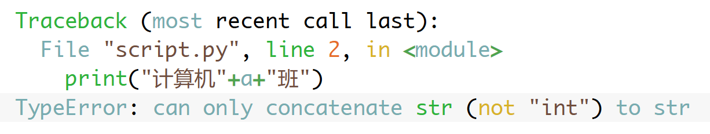

你会经常遇到变量和文字连接的场景：如果这个变量是文字类型，那还比较简单，直接使用➕连接。但是这个变量是**数字**，就麻烦了，比如：

```py
a=1
print("计算机"+a+"班")
```
这样会报错



报错的信息表示：文字不能和数字相连接，必须先把数字转成文字。

遇到这种变量和文字拼接的题目，使用格式化文字比较容易解决，同样上面的代码可以改成：

```py
a=1
print(f"计算机{a}班")
```

得到结果：计算机1班

记住格式：**引号前面写个f，然后变量用{}包裹**

并且，{}里面可以写表达式，可以得到运算的结果：

```py
print(f"1+1={1+1}")
```

得到结果：1+1=2
