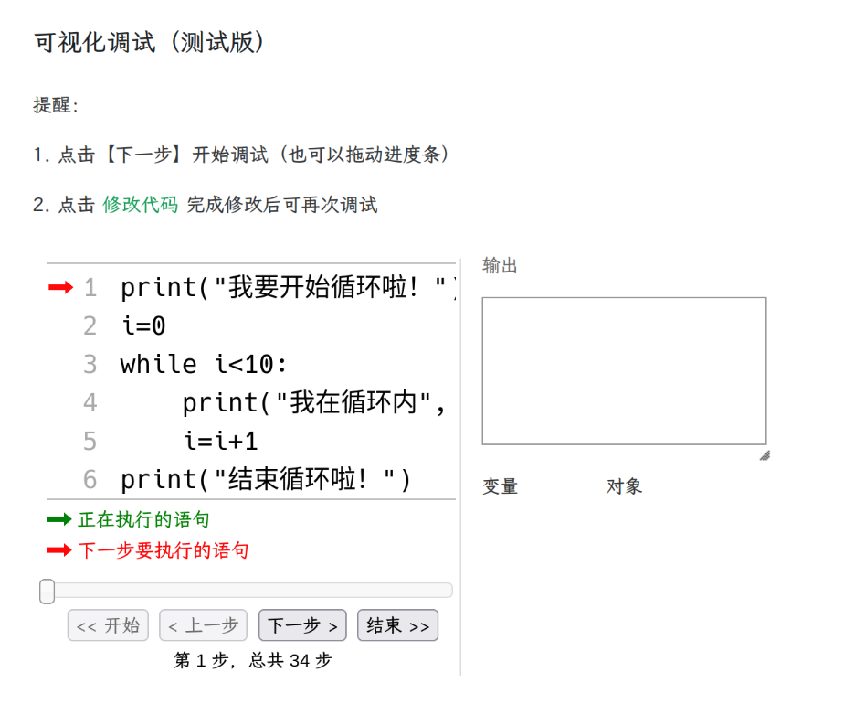
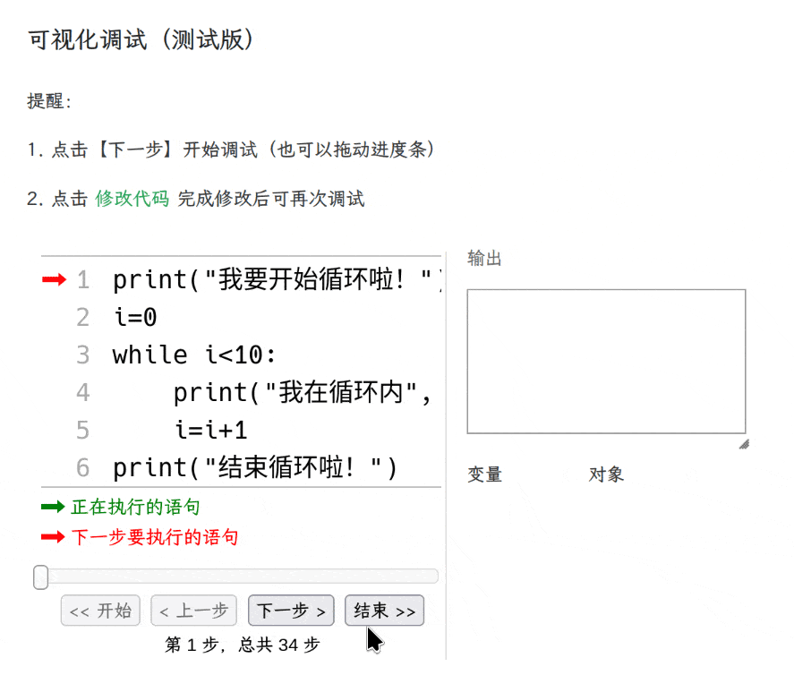
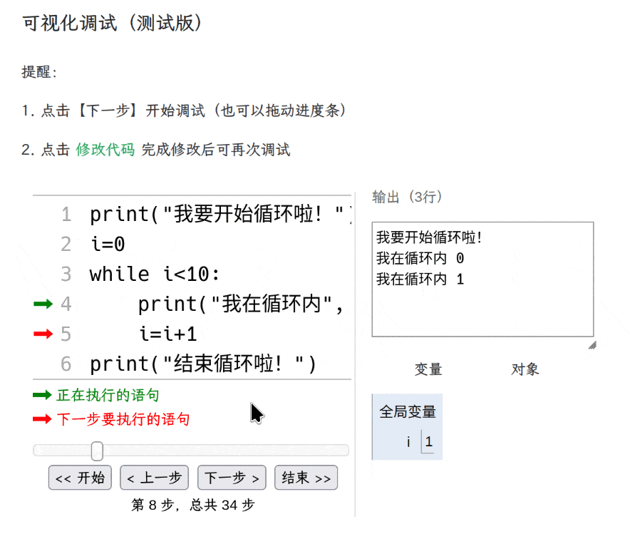

自测猫有个功能是可以看见循环过程的，叫做【可视化调试】，打开 [自测猫](https://code.xuyue.cc)

复制以下代码到自测猫

```py
print("我要开始循环啦！")
i=0
while i<10:
    print("我在循环内", i)
    i=i+1
print("结束循环啦！")
```

点击红色的【调试】按钮，弹出调试框：



绿色箭头表示当前正在执行，红色箭头表示下一步要执行。点击下一步，开始调试。



当然你也可以来回拖动进步条，这样代码就会跟着你的想法，想走到哪一步就走到哪一步。



右侧可以看到当前变量的值。
